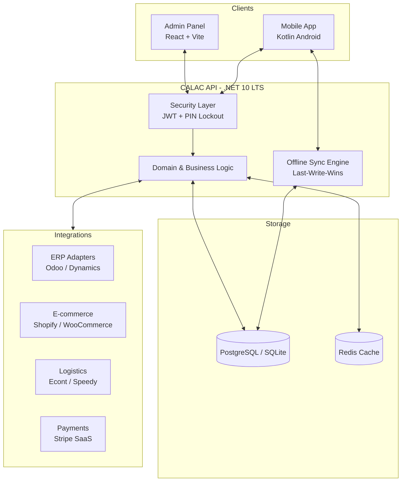

#  CALAC


**CALAC** е модерна, модулна WMS/warehouse execution платформа от ново поколение, проектирана за складове, 3PL оператори и e-commerce fulfillment центрове. Системата предлага висока мащабируемост, offline-first мобилна работа и дълбока интеграция с водещи ERP и e-commerce платформи.

---

## 📌 Текущо състояние (2026-07-23)

CALAC вече включва:
- **мулти-тенант сигурност** с JWT, refresh tokens, RBAC и audit log;
- **основни складови процеси** — локации, артикули, приемане, трансфери, picking, задачи;
- **по-напреднали операции** — planned cycle counting, batch/wave picking, FEFO/FIFO workflow и expiry alerts;
- **интеграционен слой** — webhooks, partner API ключове, ERP-ориентирана структура и SignalR нотификации;
- **SaaS readiness** — self-service onboarding и активиране на tenant subscription plan;
- **оперативна инфраструктура** — OpenTelemetry, Docker, PWA admin panel и ZPL/Labelary поддръжка.

---

## 🏗️ Архитектура



---

## 🚀 Технологичен стек

| Компонент | Технологии |
|-----------|------------|
| **Backend** | .NET 10 (LTS), C#, ASP.NET Core Web API, EF Core, PostgreSQL/SQLite, JWT, SignalR |
| **Admin Panel** | React 19, TypeScript, Vite, PWA, TanStack Query |
| **Mobile Application** | Kotlin, Android, PDA-ready workflow |
| **Infrastructure** | Docker, OpenTelemetry, Prometheus, GitHub Actions |

---

## 📦 Реализирани модули

### 🔐 Сигурност и основа
- **Voice UI (VUI)** — гласово насочване и потвърждение при Picking
- JWT автентикация и refresh token ротация
- RBAC за Admin, Supervisor и Operator
- Multi-tenancy с EF Core Global Filters
- Audit log (Immutable) и Device Lockout (PIN) защита
- Задължителна смяна на парола и Rate Limiting
- PII Encryption (Криптиране на лични данни за пратки)

### 🏗️ Складови процеси
- Управление на локации и артикули
- Goods receipt и internal transfers с **Workflow Engine**
- Picking с FEFO/FIFO/LIFO/FPFO логика
- Управление на задачи и операторски workflow
- Planned cycle counting по зона/категория
- Batch и wave picking

### 🔄 Интеграции и Модернизация
- ERP Адаптери (Odoo, Dynamics 365)
- **Outbox Pattern** за надеждна интеграция
- Webhook subscriptions и Partner API ключове
- Real-time SignalR нотификации
- **TanStack Query** за оптимизиран Admin UI
- ZPL/Labelary и GS1-128 поддръжка (17+ симбологии)

### 📊 Аналитика и Интелигентност
- **Anomaly Detection** (Z-score статистически анализ на инвентара)
- Forecasting за нива на наличности
- OpenTelemetry & Prometheus мониторинг

### ☁️ SaaS подготовка
- Self-service tenant onboarding
- Tenant subscription plan activation
- Подготовка за по-нататъшно billing и white-label разширение

---

## 📂 Структура на проекта

```text
CALAC/
├── backend/           # .NET 8 REST API и бизнес логика
├── admin/             # React + TypeScript админ панел
├── mobile/android/    # Kotlin PDA/mobile приложение
├── docs/              # Техническа документация и roadmap
├── CHANGELOG.md       # История на версиите
├── ROADMAP.md         # Текуща продуктова стратегия
└── docker-compose.yml # Инфраструктура и dev среда
```

---

## 🛠️ Системни изисквания

- Backend: .NET 10 SDK
- Frontend: Node.js 20+ и npm
- Database: PostgreSQL или SQLite за локално развитие
- Mobile: Android Studio и PDA устройство

---

## 🚦 Бърз старт (Development Only)

> [!WARNING]
> Следните данни за вход са предназначени **само за разработка и демо цели**. В реална среда винаги използвайте силни пароли и задължително ги променете при първоначално влизане.


### 1. Инфраструктура
```bash
docker compose up -d
```

### 2. Backend API
```bash
cd backend
dotnet restore
dotnet run --project src/CALAC.Api
```
- Swagger UI: http://localhost:5000/swagger

### 3. Админ панел
```bash
cd admin
npm install
npm run dev
```
- URL: http://localhost:5173

---

## 🗺️ Документация

- [ROADMAP.md](./ROADMAP.md) — текуща продуктова стратегия и приоритети
- [CHANGELOG.md](./CHANGELOG.md) — история на промените
- [docs/product-roadmap/roadmap.md](./docs/product-roadmap/roadmap.md) — допълнителен roadmap преглед
- [docs/Readme-New_systema.md](./docs/Readme-New_systema.md) — по-широко описание на системата
- [docs/moduli-new_system.md](./docs/moduli-new_system.md) — модулна структура

---

## 🔭 Следващи приоритети

- Stripe Integration и автоматизирано таксуване
- Advanced Logistics (Econt/Speedy)
- Voice picking за PDA устройства
- Route optimization за picking
- AI-Driven Analytics и аномалии
- Manufacturing (BOM) и QA контрол
- API v1 и Enterprise Security стандарти
- Роботизация (AMR) и Computer Vision R&D
- ISO 27001 Readiness и GS1 Standards

© 2026 CALAC Platform. Всички права запазени.
