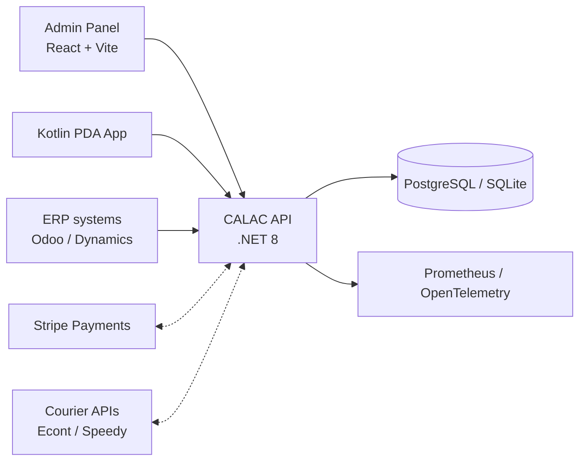

# Architecture overview

The API is the central integration layer for admin operations, mobile devices, and ERP adapters.

## Component Breakdown

### 1. Backend (.NET 8 REST API)
- **API Layer**: ASP.NET Core Controllers, Swagger, JWT Auth.
- **Domain Layer**: Clean Architecture core, Entities, Business Rules, Enums.
- **Infrastructure Layer**: Entity Framework Core (PostgreSQL/SQLite), SignalR Hubs, External Adapters (ERP, Stripe, Couriers).

### 2. Admin Panel (React 19 + Vite)
- **UI Framework**: Tailwind CSS, Lucide Icons.
- **State Management**: React Hooks, API Client (Fetch/Axios).
- **Features**: Dashboard, Inventory Management, Tenant Branding, User RBAC.

### 3. Mobile Application (Android Kotlin)
- **Local DB**: Room Persistence for offline-first support.
- **Scanning**: Hardware Barcode Support (Zebra/Honeywell) + Camera Scanning.
- **Sync Engine**: Background synchronization with Last-Write-Wins conflict resolution.

### 4. Integration Layer
- **ERP Adapters**: Odoo, Microsoft Dynamics 365.
- **Financials**: Stripe SDK for SaaS billing.
- **Logistics**: Courier APIs for label generation and tracking.
