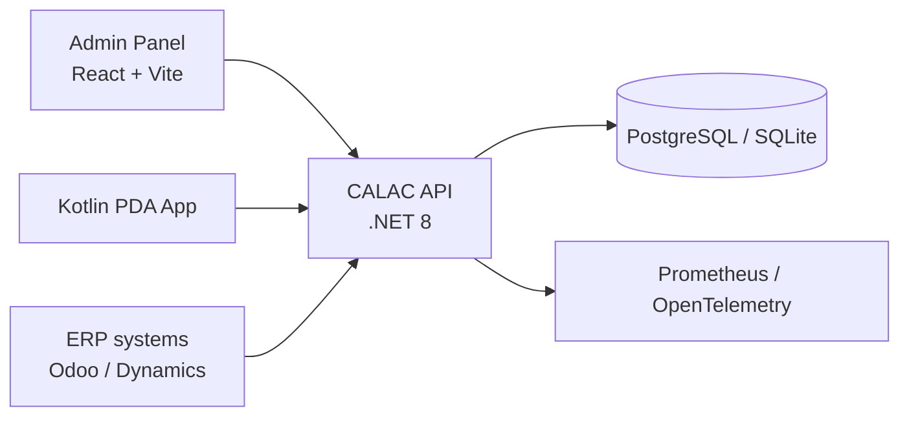

# Architecture overview

```mermaid
flowchart LR
    Admin[Admin Panel<br/>React + Vite] --> API[CALAC API<br/>.NET 8]
    PDA[Kotlin PDA App] --> API
    ERP[ERP systems<br/>Odoo / Dynamics] --> API
    API --> DB[(PostgreSQL / SQLite)]
    API --> Metrics[Prometheus / OpenTelemetry]
```

The API is the central integration layer for admin operations, mobile devices, and ERP adapters.
